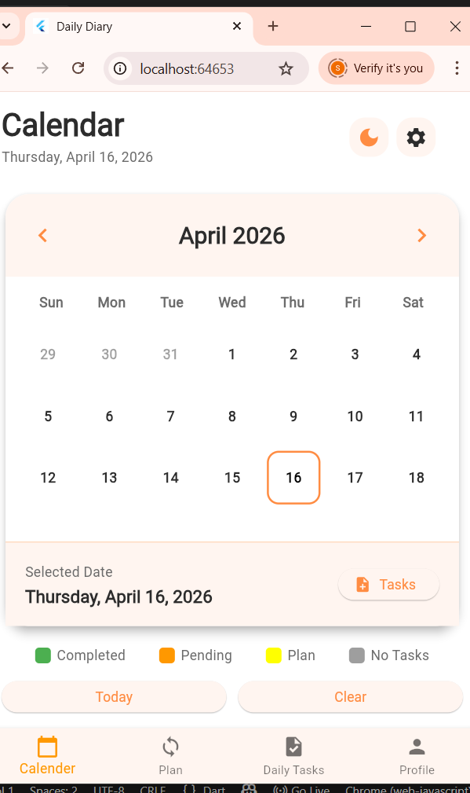

#  Daily Diary App

A modern and lightweight **Flutter application** to manage your **daily plans, tasks, and notes** — all in one place.  
Built with an **offline-first approach** and a clean, user-friendly UI.

---

## 🚀 Features

 **Plan Management**
- Create plans with start & end dates  
- Track duration and progress  

 **Task Tracking**
- Add, update, and delete daily tasks  
- Mark tasks as completed  

 **Notes**
- Write and manage personal notes  

🔔 **Smart Notifications**
- Get reminders for tasks and plans  

 **Offline First**
- Uses Hive for fast and efficient local storage  

---

## 🛠️ Tech Stack

- Flutter  
- Dart  
- Hive (Local Database)  
- Provider (State Management)  
- Flutter Local Notifications  

---

## 📸 Screenshots

### 🏠 Home Screen  
 

### 📅 Calendar View  

### ✅ Tasks Screen  

### 📝 Notes Screen  

---

## 📽️ Demo

---

## 📦 APK Download

👉 [Download APK](https://your-apk-link.com)

---

## 📂 Project Structure
